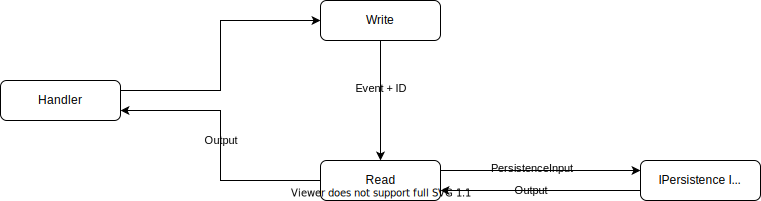

# Flexible Persistence


[](https://badge.fury.io/js/flexiblepersistence)
[](https://img.shields.io/npm/dt/flexiblepersistence.svg)

A CQRS and Event Sourcing platform

```js
// Init Journaly as a observer platform for using as a message broker
const journaly = Journaly.newJournaly() as SubjectObserver<any>;

// config read database
read = new MongoDB(
  new PersistenceInfo(
    {
      database: 'read',
      host: process.env.MONGO_HOST || 'localhost',
      port: process.env.MONGO_PORT,
    },
    journaly
  )
);

// config write database
write = new MongoDB(
  new PersistenceInfo(
    {
      database: 'write',
      host: process.env.MONGO_HOST || 'localhost',
      port: process.env.MONGO_PORT,
    },
    journaly
  )
);

// init Flexible Persistence handler with write and read databases
const handler = new Handler(write, read);

// sample object
const obj = {};
obj['test'] = 'test';

// create an event to create an object
const persistencePromise = await handler.addEvent(
  new Event({ operation: Operation.create, name: 'object', content: obj })
);

// prints create event
console.log(persistencePromise);

{
  receivedItem: {
    __v: generated,
    id: generated,
    test: 'test',
  },
  result: undefined,
  selectedItem: undefined,
  sentItem: {
    test: 'test',
  },
}
```



## Installation

This is a [Node.js](https://nodejs.org/en/) module available through the
[npm registry](https://www.npmjs.com/).

Before installing,
[download and install Node.js](https://nodejs.org/en/download/).

If this is a brand new project, make sure to create a `package.json` first with
the [`npm init` command](https://docs.npmjs.com/creating-a-package-json-file) or
[`yarn init` command](https://classic.yarnpkg.com/en/docs/cli/init/).

Installation is done using the
[`npm install` command](https://docs.npmjs.com/getting-started/installing-npm-packages-locally)
or [`yarn add` command](https://classic.yarnpkg.com/en/docs/cli/add):

```bash
$ npm install flexiblepersistence
```

or

```bash
$ yarn add flexiblepersistence
```

## Features

- Ready to use event-sourcing/CQRS design pattern

## Settings

PersistenceInfo Settings:

```js
uri?: string;
database?: string;
host?: string;
port?: number | string;
username?: string;
password?: string;
options?: string;
connectionType?: string;
ssl?: ConnectionOptions | tls.ConnectionOptions | boolean | undefined;
```

## Handler

```js
// use it to add event to databases
public addEvent(event: Event): Promise<Output<any>>;

// use it to read multiple elements from database
public readArray(
  scheme: string,
  selectedItem: any
): Promise<Output<any>>;

// use it to read a single element from database
public readItem(
  scheme: string,
  selectedItem: any
): Promise<Output<any>>;

// use it to read a single element from database using id
public readItemById(scheme: string, id): Promise<Output<any>>;
```

## Event

Event Fields:

```js
operation?: Operation;
name?: string;
selection?: unknown;
single?: boolean;
content?: any | any[];
timestamp?: string;
_id?: unknown;
__v?: unknown;
```

Operation: Similar to CRUD

```js
existent,
//Similar to create, but used to fix database.
//Use it when a data is missing
create,
//Use it to create a new element
read,
//Use it to read from database
correct,
//Similar to update, but used to fix database.
//Use it when a data is wrong
update,
//Use it to update an element
nonexistent,
//Similar to delete, but used to fix database.
//Use it when an element is not supposed to exist
delete,
//Use it to delete an element
```

It's not obligatory to use existent, correct and nonexistent. It's possible to
use just CRUD operations.

## Persistence Promise

Event Response:

```js
receivedItem: Output;
result: any;
selectedItem: any;
sentItem: any;
```

## PersistenceAdapter

It's possible to use diferent databases or services implementing
PersistenceAdapter interface, like MongoDB does.

Other implementations:

- [DAO](https://github.com/Judahh/dAOPersistence)
- [Sequelize](https://github.com/Judahh/sequelizePersistence)
- [Service](https://github.com/Judahh/servicePersistence)

## Tests

To run the test suite, first install Docker and dependencies, then run
`docker-compose up -d` and `npm test`:

```bash
$ docker-compose up -d
$ npm install
$ npm test
```

or

```bash
$ docker-compose up -d
$ yarn
$ yarn test
```

## People

The original author of Journaly is [Judah Lima](https://github.com/Judahh)

[List of all contributors](https://github.com/Judahh/flexiblepersistence/graphs/contributors)
